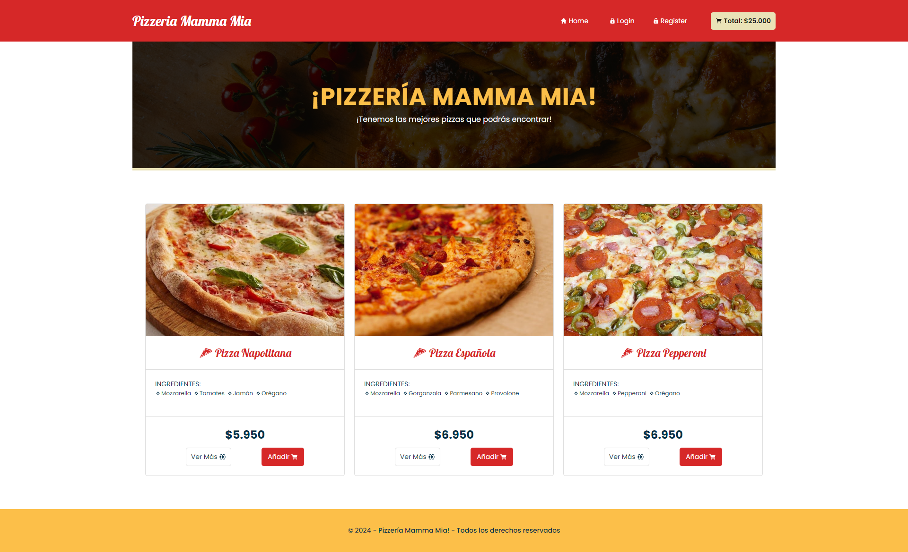

# Desafio - Pizzeria Mamma Mia

## Levantar Frontend
1. Instalar dependencias: `npm install`
2. Levantar Aplicación: `npm run dev`
3. La aplicación se ejecuta en : `http://localhost:5173`

## Levantar Backend
1. Instalar dependencias: `npm install`
2. Levantar Aplicación: `npm run start`
3. La aplicación se ejecuta en : `http://localhost:5000`

